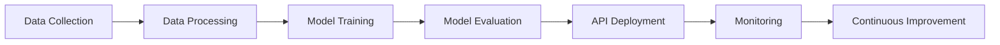
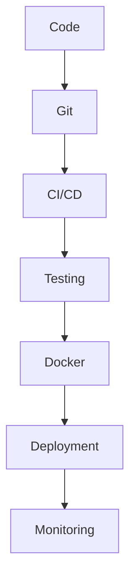

<!-- ===================== HERO ===================== -->

<p align="center">

</p>

<p align="center">

</p>


<p align="center">


</p>


---

# 👩‍💻 About Me


🎓 Computer Engineering Student  
🤖 Artificial Intelligence & Data Science Focus  


I engineer intelligent systems by combining:


- 🧠 Machine Learning
- ⚙️ Backend Engineering
- 🐳 DevOps Automation
- 📊 Monitoring & Observability
- ☁️ Cloud Native Development


My objective:

> Transform AI models into reliable, scalable and deployable systems.


---

# 🚀 2026 Engineering Vision


```yaml
Focus:
  - Machine Learning Engineering
  - MLOps
  - Backend Architecture
  - Cloud Infrastructure
  - AI System Design

Goals:
  - Production ML pipelines
  - Automated deployment
  - Scalable AI APIs
  - Observability driven systems
```


---

# 🤖 AI Engineering Stack


<p align="center">


<br>

<br>

<br>

<br>

</p>


---

# 🧠 AI System Engineering





---

# 📊 GitHub Analytics


<p align="center">


</p>


<p align="center">


</p>


<p align="center">


</p>


---

# 🏆 GitHub Achievements


<p align="center">


</p>


---

# 🐍 Contribution Journey


<p align="center">


</p>


---

# 📂 Featured Engineering Projects


<p align="center">


<a href="https://github.com/Nourhenebenothmen22">

</a>


<a href="https://github.com/Nourhenebenothmen22">

</a>


</p>


---

# 🏗️ Developer Workflow





---

# 📈 Engineering Principles


| Principle | Meaning |
|-|-|
| Clean Architecture | Maintainable systems |
| Automation First | Reduce manual work |
| Observability | Measure everything |
| Scalability | Design for growth |
| Reliability | Production mindset |
| Continuous Learning | Improve every day |


---

# 🌐 Connect With Me


<p align="center">


<a href="https://github.com/Nourhenebenothmen22">

</a>


<a href="https://www.linkedin.com/in/nourhen-ben-othmen-a811ab221/">

</a>


<a href="mailto:benothmennourhen8@gmail.com">

</a>


</p>


---

# 📊 Dynamic Profile Metrics


<p align="center">


</p>


---

<p align="center">


</p>
